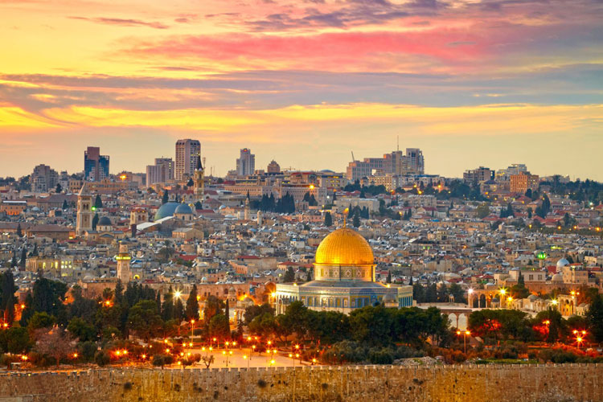

# Equalization and Quantization
In this project I implemented histogram equalization and quantization of images.

## Histogram Equalization
The goal is to improve the image contrast and to make use of all gray levels.
The algorithm for the histogram equalization is as shown below:
1. Compute the image histogram.
2. Compute the cumulative histogram.
3. Normalize the cumulative histogram.
4. Multiply the normalized histogram by the maximal gray level value (Z − 1).
5. Verify that the minimal value is 0 and the the maximal is Z−1, otherwise, stretch the result linearly
in the range [0, Z − 1].
6. Round the values to get integers.
7. Map the intensity values of the image using the result of step 6.

For example:
Original image:

Original histogram:

Image after histogram equalization:

Histogram after equalization:

## Quantization
